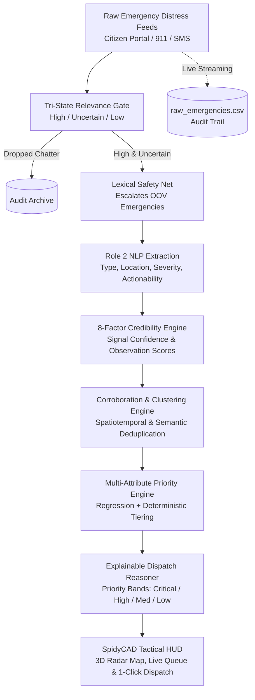

<div align="center">

# 🕸️ KAREN'S EAR // SpidyCAD
### AI-Powered Autonomous Emergency Dispatch & Triage Engine
**Bit N Build '26 Hackathon | Track 2: Artificial Intelligence & Machine Learning**

[](https://fastapi.tiangolo.com)
[](https://streamlit.io)
[](https://python.org)
[](file:///Users/rishav07/Documents/BitNBuild/karen-emergency-ai-BitnBuild-26/tests)
[](LICENSE)

*Built by **Team AlgoRhythm**: Preetika, Rishav, Ojas, and Aditya*

---

</div>

## 📌 Executive Summary & The Mission

> *"When New York is in trouble, the calls and messages pour in all at once — panicked, half-finished, overlapping. 'There's smoke on 5th.' 'Someone's stuck under the rubble.' 'The lizard-thing is heading downtown.' Buried in that flood of words is exactly the information Spider-Man needs: what's happening, where, and how urgent. But no human can read it all fast enough. Karen, Peter's AI assistant, needs to cut through the chaos and tell him where to swing first."*

During severe urban crises, emergency 911 dispatch centers and public communication feeds experience catastrophic information deluge. High-volume, fragmented distress messages create severe cognitive bottlenecks. 

**Karen's Ear (SpidyCAD)** is an end-to-end, edge-resilient AI dispatch intelligence system designed to ingest chaotic, noisy civic reports, validate emergency credibility, cluster duplicate incidents, compute explainable priority triage scores, and render real-time tactical situational awareness to dispatchers and first responders.

---

## 🚀 Core Architectural Pipeline

Karen's Ear operates on a strict 6-phase operational paradigm:  
**Detect $\longrightarrow$ Understand $\longrightarrow$ Corroborate $\longrightarrow$ Predict $\longrightarrow$ Rank $\longrightarrow$ Dispatch**



### 1. Tri-State Relevance Gate & Lexical Safety Net
- **Decoupled Architecture**: Strictly separates *relevance* ("Is this an emergency?") from *priority* ("Where must help deploy first?").
- **Tri-State Logic**: Rather than a brittle binary filter, outputs `HIGH`, `UNCERTAIN`, or `LOW`.
- **Lexical Safety Net**: Deterministically scans for critical distress markers (`explosion`, `collapse`, `gunshot`, `trapped`, `bleeding`). If found without false-positive context (`drill`, `movie`, `rehearsal`), low-confidence classifications are rescued to `UNCERTAIN` and never silently discarded.

### 2. Role 2 NLP Extraction & 8-Factor Credibility Assessment
- **Entity & Hazard Extraction**: Classifies reports into standardized incident types (`fire`, `explosion`, `accident`, `medical`, `collapse`, `flood`, `crime`, etc.) and normalizes landmarks.
- **8-Factor Multi-Signal Credibility Model**: Computes confidence ($C \in [0.0, 1.0]$) evaluating:
  1. *First-Person Observation*
  2. *Linguistic Specificity*
  3. *Syntactic Coherence*
  4. *Direct Actionability*
  5. *Casualty & Injury Reporting Signal*
  6. *Location Entity Density*
  7. *Internal Consistency*
  8. *Information Completeness*

### 3. Corroboration & Incident Clustering
- Groups concurrent reports referencing identical events using string distance and NYC spatiotemporal clustering.
- Dynamically awards an additive corroboration boost $\Delta_k$ based on cluster size $N$:
  $$\Delta_k = \min\Big(0.05, \, (N - 1) \times 0.015\Big)$$

### 4. Multi-Attribute Priority Engine
Computes a continuous priority score $\mathcal{P} \in [0.0, 1.0]$ synthesized from normalized severity ($S$), actionability ($A$), credibility ($C$), and the corroboration bonus:
$$\mathcal{P} = \mathrm{clamp}\Big(0.45 \cdot S + 0.35 \cdot A + 0.20 \cdot C + \Delta_k, \; 0.0, \; 1.0\Big)$$

| Priority Band | Score Range | Operational Meaning | Automated Dispatch Recommendation |
| :--- | :--- | :--- | :--- |
| 🔴 **CRITICAL** | `0.85 - 1.00` | Immediate life-safety threat; structural failure / casualties | Immediate Spider-Sense / Heavy Rescue Deploy |
| 🟠 **HIGH** | `0.70 - 0.84` | Significant hazard; rapid escalation risk | Priority First Responder Dispatch |
| 🟡 **MEDIUM** | `0.45 - 0.69` | Developing situation; property risk without entrapment | Area Patrol / Secondary Unit Staging |
| 🔵 **LOW** | `0.00 - 0.44` | Non-acute advisory or minor disturbance | Queue for verification / Community response |

---

## 👥 Team AlgoRhythm (Roles & Responsibilities)

| Team Member | Core Focus & Modules | Key Deliverables |
| :--- | :--- | :--- |
| **Preetika** | **Priority Engine & ML** | Multi-attribute priority formula, Random Forest regression ranker, explainable dispatch reasons, priority dataset generation |
| **Rishav** | **FastAPI Backend & HUD Dashboard** | High-performance FastAPI server, GPS auto-resolution, raw CSV audit logging, PyDeck 3D radar map, Streamlit tactical HUD |
| **Ojas** | **NLP & Credibility Pipeline** | Role 2 NLP extraction, hazard classification, 8-factor multi-signal credibility assessment |
| **Aditya** | **Datasets & Ground Truth** | NYC emergency corpus curation (8,735 incidents), relevance evaluation datasets, data normalization |

---

## 📊 Data Schema Interface

All modules communicate using the standardized data contract defined in [DATA_SCHEMA.md](file:///Users/rishav07/Documents/BitNBuild/karen-emergency-ai-BitnBuild-26/DATA_SCHEMA.md):

```json
{
  "report_id": "R001",
  "text": "Explosion near Times Square, multiple people injured and trapped!",
  "incident_type": "explosion",
  "location": "Times Square",
  "severity": "critical",
  "actionability": "high",
  "credibility": 0.86,
  "priority": 0.94,
  "latitude": 40.7580,
  "longitude": -73.9855,
  "gps_xy": "40.7580, -73.9855",
  "status": "pending",
  "dispatch_status": "pending",
  "credibility_factors": {
    "first_person_observation": 0.85,
    "specificity": 0.90,
    "coherence": 1.0,
    "actionability": 0.95,
    "casualty_reporting_signal": 0.80,
    "location_density": 0.70,
    "internal_consistency": 1.0,
    "information_completeness": 0.85
  }
}
```

---

## 💻 Tech Stack & Architecture

- **Backend**: Python 3.11+, [FastAPI](https://fastapi.tiangolo.com/), Pydantic v2, Uvicorn
- **Dashboard UI**: [Streamlit](https://streamlit.io/), [PyDeck](https://deckgl.github.io/pydeck/) (3D Hexagon & Radar Map), Pillow, Streamlit Autorefresh
- **Machine Learning & NLP**: Scikit-Learn (Random Forest, Logistic Regression, TF-IDF), Joblib, Pandas, NumPy
- **Storage & Logging**: In-Memory Real-Time Database, JSON storage, Streaming CSV Audit Logger (`raw_emergencies.csv`)
- **Testing**: PyTest & FastAPI TestClient

---

## 🛠️ Quickstart & Local Setup

### 1. Clone & Set Up Python Environment
```bash
# Clone the repository
git clone https://github.com/preetmish086/karen-emergency-ai-BitnBuild-26.git
cd karen-emergency-ai-BitnBuild-26

# Create and activate virtual environment
python3 -m venv .venv
source .venv/bin/activate

# Install required dependencies
pip install -r requirements.txt
```

### 2. Start the FastAPI Backend
Launch the high-performance triage server:
```bash
uvicorn backend:app --host 127.0.0.1 --port 8000 --reload
```
* Interactive Swagger Docs: [http://127.0.0.1:8000/docs](http://127.0.0.1:8000/docs)
* Health Check: [http://127.0.0.1:8000/health](http://127.0.0.1:8000/health)

### 3. Start the SpidyCAD Tactical Dashboard
In a new terminal window (with `.venv` active):
```bash
streamlit run frontend/app.py --server.port 8501
```
Open [http://localhost:8501](http://localhost:8501) in your browser to access:
- **Tactical Command HUD**: Live radar map, active priority queue, and 1-click unit dispatch.
- **Citizen Distress Portal**: Direct emergency report submission with auto-GPS resolution.
- **Dispatcher Access Portal**: Role-based access control and sector monitoring.

---

## 📡 Key REST API Endpoints

| Method | Endpoint | Description |
| :--- | :--- | :--- |
| `GET` | `/` | API status, root manifest, and service links |
| `GET` | `/health` | System health check and active report count |
| `GET` | `/reports` | Priority-sorted list of all active incidents (supports filtering) |
| `POST` | `/ingest` | Ingests new emergency text, runs NLP & priority scoring, logs to CSV |
| `POST` | `/reports/{id}/dispatch` | Dispatches emergency unit and updates incident state |

#### Example Ingestion Request:
```bash
curl -X POST http://127.0.0.1:8000/ingest \
  -H "Content-Type: application/json" \
  -d '{
    "text": "Heavy fire visible on 3rd floor near Central Market, people calling for help",
    "location": "Central Market",
    "gps_xy": "40.7527, -73.9772"
  }'
```

---

## 🧪 Testing & Verification

The test suite validates the REST API endpoints, priority scoring boundaries, and ML ranker integrity:

```bash
.venv/bin/pytest tests/ -v
```

**Test Results**:
```text
tests/test_api.py ........                                [ 50%]
tests/test_priority.py .......                            [ 93%]
tests/test_ranker.py .                                    [100%]

======================== 16 passed in 1.45s =========================
```

---

## 📁 Repository Structure

```text
karen-emergency-ai-BitnBuild-26/
├── backend.py                  # Core FastAPI application & CSV ingestion engine
├── raw_emergencies.csv         # Real-time append-only CSV audit stream
├── requirements.txt            # System dependencies
├── DATA_SCHEMA.md              # Cross-module data interface contract
├── README.md                   # Project documentation
│
├── frontend/                   # SpidyCAD Tactical HUD
│   ├── app.py                  # Streamlit application with PyDeck 3D radar & UI views
│   └── public/logos/           # Tactical HUD background SVG/PNG vector assets
│
├── src/                        # Core algorithmic engine
│   ├── schema.py               # Pydantic v2 schemas and enumerations
│   ├── pipeline.py             # Integrated processing pipeline
│   ├── api/                    # API sub-module routing
│   ├── priority/               # Priority engine, ML ranker, and formula features
│   └── relevance/              # Relevance filtering model
│
├── role2/                      # Role 2 NLP & Credibility
│   └── src/pipeline/           # 8-factor credibility assessment & NER pipeline
│
├── data/                       # Datasets & evaluation outputs
│   ├── priority_output.json    # Pre-calculated priority output for 8,735 NYC incidents
│   ├── final_dataset_sample.csv
│   └── sample/sample_reports.json
│
├── doc/                        # Architecture specs & LaTeX technical report
│   └── main.tex                # Complete Bit N Build '26 technical paper
│
└── tests/                      # PyTest automated test suite
    ├── test_api.py             # API route & response validation
    ├── test_priority.py        # Priority engine formula & edge case testing
    └── test_ranker.py          # ML ranker unit tests
```

---

<div align="center">
  <sub>Engineered with ❤️ for <strong>Bit N Build '26</strong> by Team AlgoRhythm.</sub>
</div>