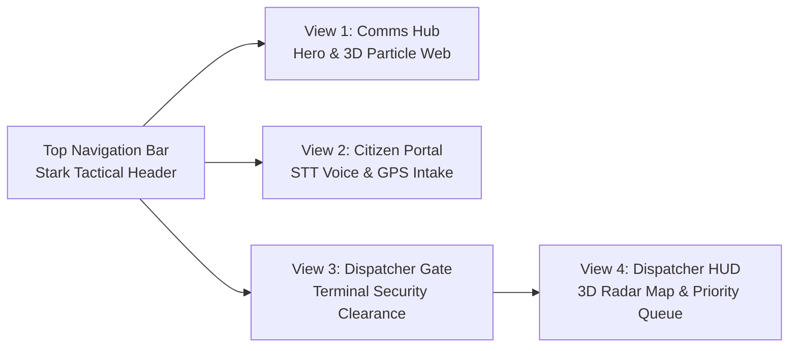

# 🕸️ SpidyCAD Tactical HUD Frontend
### Next-Generation Emergency Dispatch & Civic Distress Command Interface
**Team AlgoRhythm // Bit N Build '26 (Track 2: AI & ML)**

---

## 📌 Overview

The **SpidyCAD Tactical HUD** is an edge-resilient, real-time command interface built with **Streamlit** and **Pydeck (Deck.GL 3D)**. Inspired by Spider-Man's Stark Suit OS (*Karen*), it provides human emergency dispatchers and distressed citizens with instant, intuitive, and zero-latency situational awareness during metropolitan crises.

The frontend serves two primary user roles:
1. **Civic Reporters (Citizens):** Fast, accessible distress intake with Speech-to-Text audio dictation, automatic GPS beacon resolution, borough locking, and live audio synthesis feedback.
2. **First Responders & Authorities (Dispatchers):** High-density 3D GPU-accelerated tactical radar map, real-time incident queue sorted by priority ($P1 \to P4$), live audio alerts for critical hazards, and 1-click unit dispatch.

---

## 🚀 Key Architectural Views



### 1. Global Navigation Bar (`render_top_navigation_bar`)
- **Persistent Stark Header:** Sticky, dark obsidian navbar featuring the official SpidyCAD Stark Tactical Badge (`spidycad-logo.svg`).
- **Telemetry Indicators:** Live system uptime, backend connection ping, and fast tab routing across all sub-views.

### 2. View 1: Comms Hub / Landing Hero (`render_landing_page`)
- **3D Particle Web Canvas:** Interactive WebGL/Canvas Spider-Sense particle mesh that reacts dynamically to cursor movements.
- **Pulsing Emergency CTA:** Massive crimson-glow action button directing distressed citizens instantly to intake.
- **System Metrics:** High-level summary of active NYC incidents, priority tiers, and AI credibility safeguards.

### 3. View 2: Citizen Distress Portal (`render_citizen_portal`)
- **Instant Speech-to-Text (STT):** Browser-native Web Speech API dictation allows panicked citizens to speak their emergency without typing.
- **Hierarchical GPS Geocoding:**
  - **🛰️ Fetch Coordinates:** Simulates satellite beacon acquisition, resolves lat/lon coordinates, and reverse-geocodes to the nearest NYC landmark.
  - **Manual Borough/Subarea Locking:** Pre-resolves coordinates for all 5 NYC boroughs, bridges, subways, and avenues to guarantee valid coordinates.
- **Voice Feedback (TTS):** Generates emergency acknowledgment audio confirmation using synthesized speech.
- **Zero-Latency Ingestion:** Transmits JSON payloads directly to FastAPI `/ingest` with streaming CSV audit trail logging.

### 4. View 3: Dispatcher Security Gate (`render_dispatcher_login`)
- **Clearance Gatekeeper:** Protects municipal tactical data with Stark security code verification (`KAREN-2026`).
- **Access Guard:** Blocks unauthenticated users from viewing live emergency queues or deploying first responder units.

### 5. View 4: Authority Tactical Command HUD (`render_dispatcher_dashboard`)
- **Pydeck 3D Radar Map:**
  - Hardware-accelerated Deck.GL scatterplot rendering with glowing halos and pulsing radii.
  - Color-coded triage pings:
    - 🔴 **$P1$ Critical ($> 0.80$):** Scarlet Red (`#EF4444`) with outer warning beacon
    - 🟠 **$P2$ High ($0.60 - 0.80$):** Tactical Orange (`#F97316`)
    - 🔵 **$P3$ Medium ($0.40 - 0.60$):** Cyan / Sky Blue (`#38BDF8`)
    - ⚪ **$P4$ Low ($< 0.40$):** Muted Slate (`#94A3B8`)
  - **Deterministic Micro-Jitter:** Displaces overlapping pins at the same landmark (e.g., Times Square) by $< 0.0008^\circ$ so all incidents remain visible and clickable.
- **Live 3-Second Auto-Refresh:** Automatically synchronizes with the backend queue via `st_autorefresh`.
- **Explainable Dispatch Cards:** Displays the incident category, casualty count, 8-factor credibility score, and model explainability rationale.
- **1-Click Unit Deployment:** Instantly patches report status to `"dispatched"` and assigns available units (e.g., `Spider-Man / FDNY Team 1`).

---

## 🛠️ Tech Stack & Dependencies

| Component | Library / Framework | Purpose |
| :--- | :--- | :--- |
| **UI Framework** | Streamlit ($\ge 1.30$) | Reactive Python application framework |
| **Spatial Radar** | Pydeck + Deck.GL | 3D GPU-accelerated spatial map visualization |
| **Styling & Theme** | Custom CSS + HTML Injection | Dark obsidian theme with Stark cyan/crimson glows |
| **Audio Processing** | Web Speech API + HTML5 Audio | Speech-to-Text dictation & synthesized audio playback |
| **HTTP Client** | Requests | Asynchronous REST communication with FastAPI backend |
| **Brand Assets** | SVG + Base64 Encoding | Crisp, zero-distortion tactical badges and favicons |

---

## ⚡ Execution & Development

### 1. Start the FastAPI Backend (Port 8000)
Ensure the backend server is running first:
```bash
PYTHONPATH=. ./.venv/bin/uvicorn backend:app --host 127.0.0.1 --port 8000 --reload
```

### 2. Launch the Streamlit Frontend (Port 8501)
```bash
./.venv/bin/streamlit run frontend/app.py --server.port 8501 --server.headless true
```

Access the application in your browser:
- **Local URL:** `http://localhost:8501`
- **Dispatcher Access Code:** `KAREN-2026`

---

## 📁 Directory Structure

```
frontend/
├── app.py                # Complete monolithic Streamlit SpidyCAD HUD application
├── README.md             # Frontend architectural and usage documentation
└── public/
    └── logos/            # Production brand assets and transparent HUD icons
```

---

## 🛡️ Security & Resilience Standards

- **Zero-Storage PII:** Transmitted citizen reports are anonymized; voice dictation is processed in-memory.
- **CSV Injection Defense:** Multi-line text inputs are sanitized by stripping carriage returns and newlines before submission.
- **Fail-Safe Fallbacks:** If the FastAPI backend experiences network interruption, the UI gracefully reports comms offline without crashing the radar map.
