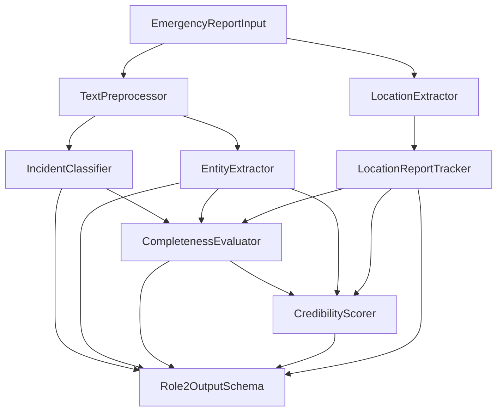

# Role 2 Architecture: Natural Language Processing & Credibility Assessment

## System Overview

Role 2 forms the natural language intelligence tier of the Emergency Response AI System. Its objective is to ingest individual natural language emergency reports (from stream or batch CSV datasets like `nyc_emergency_reports_clean.csv`) accompanied by optional GPS metadata or textual/manual locations, perform incident categorization, extract entity and casualty numbers (without hallucination), compute location report density consensus, assess report credibility with explainable signals, and deliver a clean, validated JSON output payload for downstream modules (Role 3 spatial-temporal clustering & Role 4 emergency prioritization).

---

## Key Modules & Component Design

### 1. Preprocessing (`src/preprocessing/`)
- **Class**: `TextPreprocessor`
- **Function**: Standardizes natural human language input. Normalizes whitespace, expands contractions, and maps text numbers ("four", "two", "several") to numeric digits ("4", "2", "3") for reliable pattern matching while preserving full sentence context.

### 2. Incident Categorization (`src/classification/`)
- **Base Class**: `BaseIncidentClassifier`
- **Implementation**: `IncidentClassifier`
- **Categories**: `accident`, `fire`, `flood`, `medical`, `explosion`, `collapse`, `crime`, `missing_person`, `other`, `unknown`.
- **Strategy**: Combines pattern-based semantic domain rules with a local scikit-learn TF-IDF Naive Bayes classifier trained on `nyc_emergency_reports_clean.csv` (8,735 emergency reports).

### 3. Entity & Casualty Extraction (`src/extraction/`)
- **Base Class**: `BaseEntityExtractor`
- **Implementation**: `EntityExtractor`
- **Entities Extracted**: `total_affected`, `injured`, `dead`, `missing`, `trapped`, `rescued`, `evacuated`.
- **CRITICAL NO-HALLUCINATION POLICY**:
  - Emergency reports are incomplete by nature.
  - If a reporter states *"I saw a fire break out in my building."*, all unstated casualty fields default strictly to `None` (`null` in JSON).

### 4. Location & Density Tracking (`src/extraction/location_extractor.py` & `location_tracker.py`)
- **Classes**: `LocationExtractor`, `LocationReportTracker`
- **Function**:
  - Handles optional GPS coordinates (`latitude`, `longitude`).
  - Extracts textual/manual location descriptions from metadata or natural language text.
  - Counts how many reports originate from the same location/area (`location_report_count`).

### 5. Information Completeness Evaluator (`src/extraction/completeness_evaluator.py`)
- **Class**: `CompletenessEvaluator`
- **Function**: Separates report information completeness from credibility/truthfulness.
- **Outputs**: Flags (`has_casualty_information`, `has_affected_count`, `has_injury_information`, `has_location_information`) and a bounded `completeness_score` $\in [0, 1]$.

### 6. Credibility Assessment (`src/credibility/`)
- **Base Class**: `BaseCredibilityScorer`
- **Implementation**: `CredibilityScorer`
- **Score Range**: Bounded $[0.0, 1.0]$.
- **Decomposed Factors**:
  1. `first_person_observation` (0.20 weight): Detects first-person witness pronouns ("I saw", "my building").
  2. `specificity` (0.15 weight): Evaluates concrete event markers, street/landmark mentions, and numbers.
  3. `coherence` (0.15 weight): Penalizes character spam or gibberish text.
  4. `actionability` (0.15 weight): Verifies presence of actionable emergency intent.
  5. `casualty_reporting_signal` (0.10 weight): **Bonus signal** when reporter explicitly details affected/injured people count.
  6. `location_density` (0.15 weight): **Consensus signal** giving higher credibility when multiple independent reports arrive from the same location.
  7. `internal_consistency` (0.10 weight): Penalizes numeric contradictions (e.g. `injured` > `total_affected`).
- **Mathematical Formula**:
  $$\text{Credibility} = \sum_{i=1}^{7} w_i \times \text{Factor}_i$$

---

## Technology Stack & Zero Paid API Guarantee
- **Python**: 3.11+
- **Pydantic v2**: Contract definition & strict validation.
- **scikit-learn**: TF-IDF & Naive Bayes classification.
- **pandas**: Dataset processing and location frequency counting.
- **pytest**: Automated unit & contract testing.
